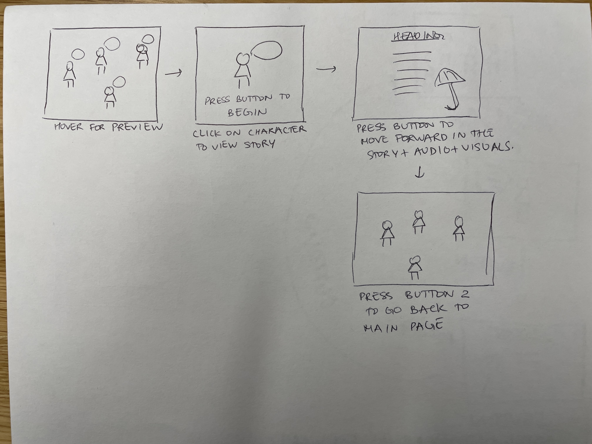
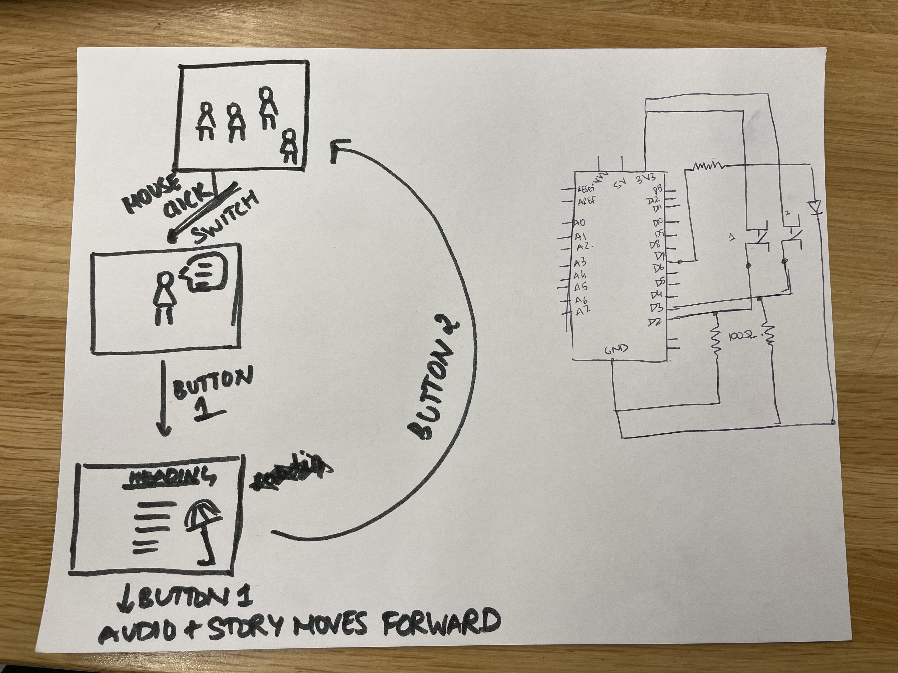

Final_Week 2:
I decided to go ahead with the idea of creating an interactive storytelling. But instead of a classic children's story, I chose to represent real, diverse stories about girls beginning their period as a means of awareness for young girls.
Interactions: 
  Input: Clicks on the computer, button on Arduino
  Output: Visuals on the computer, LED & sound & Haptics on Arduino
Description of any external data or library that you are planning to use: 
  I would love to try and use a library to draw the characters. Ex. - https://github.com/gaba5/p5.shape.js
Reference images, texts and projects: 
    https://storymaps.arcgis.com/stories/4f8da19484ea46e0abaacee95312f26c
Plan for user testing: 
  I will ask different people to follow the instructions and document if there are any instructions they are unclear with
Short discussion of why your project is relevant:how is it related to our readings? how does it connected to society? why is it important to you?: 
  I read somewhere that women were not considered in medical related research till about 1993. Because of this, a lot of healthcare today is not mindful of the actual needs of women. Keeping this in mind, I wanted to create a space to tell stories of different women's journey with their health. 
Pseudocode or an outline of how you plan to organize your code: 
  In the sketch file 
Documentation of visual experiments: 
  
Description of any code written so far: 
  Currently, I have laid out a rough layout of what conponents will make up the code. 

HW12: 
I chose to do a serial connection between Arduino and p5js. I chose to create a serial connection due to it's simplicity and since my Arduino circuit mainly consisted of only buttons, I thought it wouldn't be too difficult to just keep the Arduino connected the entire time. Moreover, since the Wi-Fi connection does not work in the school campus, I thought that would limit me to only work on it at home.
I first wrote the code in the sketch.js file to establish the connection. Next, I wrote the code on Arduino. I referred to the reference video for both the sides of code. Thereafter, I compiled the Arduino file to ensure there was no error, and ran the file. The console on Chrome was initially showing an error of "Failed to open serial port". However, once I closed the serial monitor on Arduino, it did not show the error anymore. 

FSM and circuit diagram respectively 

Image of circuit

